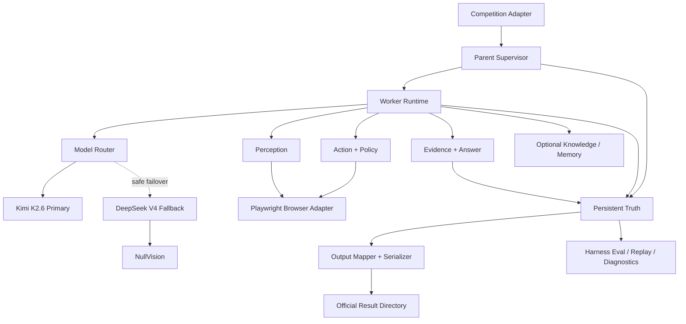
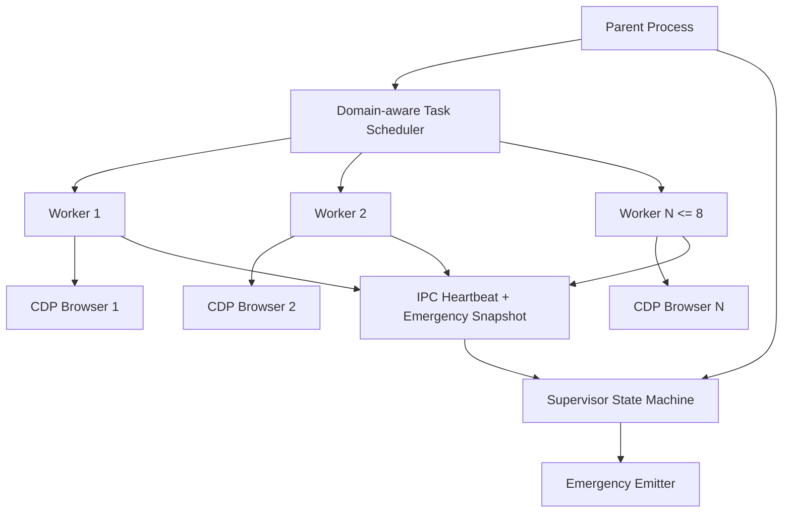
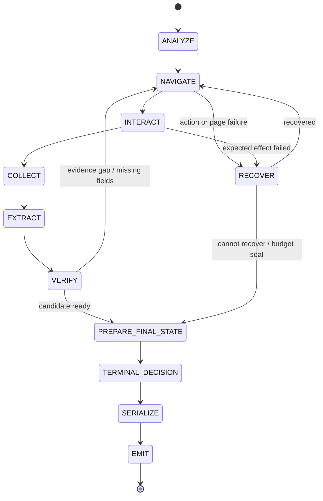

# EverWeb Harness 架构设计 v2.2（Kimi First）

> WebRetriever Challenge 2026 · Protocol III
>
> Kimi First 修订版：在 v2.1 审查通过的架构边界上，将 Kimi K2.6 调整为默认主模型与默认视觉模型，将 DeepSeek V4 调整为文本型备选方案；正式比赛模板发布后仍必须执行 Contract Reconciliation。

| 项目 | 内容 |
| --- | --- |
| 文档版本 | v2.2.0 |
| 文档日期 | 2026-07-29 |
| 前序版本 | [`EverWeb_Architecture_v2.1_Reviewed.md`](../archive/EverWeb_Architecture_v2.1_Reviewed.md) |
| 工程名 | EverWeb Harness，简称 EverWeb |
| 目标赛道 | Protocol III：真实网站端到端导航与信息抽取 |
| 主语言 | Python 3.12 |
| 浏览器边界 | Playwright，经官方提供的 CDP URL 连接 |
| 核心模型路线 | 默认主方案：Kimi K2.6；备选方案：DeepSeek V4-Pro/V4-Flash；混合路由仅在专项实验或故障降级中启用 |
| 运行状态真相源 | Append-only JSONL + 不可变 Artifact + EmergencySnapshot |
| 语义记忆 | EverOS 开发期并行轨道；正式评分路径默认关闭 |
| 文档状态 | 可实施基线；Kimi First 路线已定，比赛模板相关内容仍为“待对齐契约” |

---

## 0. 一页执行结论

EverWeb 不是“让一个大模型不断看网页并点击”的脚本，而是一个具有明确控制权边界的 Web Agent Harness：

```text
Task
  → Competition Contract
  → Answer Contract
  → Perceive / Plan / Guard / Act / Verify
  → Evidence Ledger
  → Structured Answer
  → Deterministic Verification
  → Prepare Final State
  → Terminal Decision
  → Pure Serialization
  → Official Output
```

一句话定义：

> **EverWeb 是一个由进程外 Supervisor 监管、以结构化感知驱动交互、以证据账本约束答案、以双门禁决定内部终态、并通过纯序列化输出适配正式比赛契约的 Web Agent Harness。**

本版本相对 v2.0 的根本修订：

1. **把开源 NavEval 与正式 Protocol III 评分契约彻底分离。**
2. **删除 `status=""`、`status 永不为 FAIL` 等依赖开源实现细节的策略。**
3. **把 Finalize 拆成有副作用的 `PREPARE_FINAL_STATE` 与无副作用的 `SERIALIZE`。**
4. **引入进程外 Supervisor 和 EmergencyEmitter，Worker 被杀也必须形成合法输出。**
5. **引入唯一权威 StepMeter，正式步骤只在 CompetitionAdapter 定义的边界计量。**
6. **URL、动作、证据、截图全部来自真实追加事实，禁止结尾补写或重排伪造。**
7. **Kimi K2.6 是默认主方案；DeepSeek V4 是显式备选，不允许无记录静默切换；视觉增益仍用 Kimi 同模型消融测量。**
8. **通用知识默认关闭，只有验证集配对 A/B 证明正收益后才进入正式配置。**
9. **所有影响正式模型上下文的 Provider 都进入 ScoringPathProviderManifest。**
10. **Prompt Injection、任意 HTTP、下载解析和秘密脱敏落实为代码边界，而不是 Prompt 约定。**
11. **模型实施顺序调整为 Kimi First：Week 1 即跑 Kimi 多模态闭环，Week 2 再建设 DeepSeek 文本备选与安全切换。**
12. **生产路由与实验路由分离：Kimi 主路径是产品决定，A/B 用于量化备选损失和是否值得混合，而不是重新决定默认模型。**

### 0.1 当前官方事实基线

截至 2026-07-29，官方公开指南确认：

| 项目 | 当前公开规则 |
| --- | --- |
| 赛道 | Protocol III，导航与信息抽取端到端评测 |
| 任务数量 | 100 道新任务，与公开数据集评测题不重叠 |
| 起点 | 每题从指定网站/初始网页出发 |
| 浏览器 | 官方云端浏览器，通过 CDP 提供 |
| 交互 | 所有浏览器交互必须经 Playwright |
| 搜索引擎 | 禁止 |
| 并发 | 最多 8 个任务 |
| 单次模型请求超时 | 3 分钟 |
| 每题步骤 | 最多 100 步 |
| 任务级重试 | 无；失败计 0 分 |
| 模型资源 | 选手自备商业 API 或自部署模型 |
| 正式模板 | 后续发布，提供标准化输入输出接口 |

必须注意：

- 官方开源仓库目前主要展示 Protocol I 导航实现；
- 开源 NavEval 只应作为本地导航评测插件；
- 正式 Protocol III 的 `agent_answer`、status、目录、截图选择和评分输入，以比赛模板为唯一权威；
- 每题总墙钟、“一步”的精确定义、下载后解析边界等未公开事项不得写死。

### 0.2 设计优先级

按对最终成功率的预期贡献排序：

1. **输出与正式契约正确**：先保证任务一定被评测，而不是因格式、status 或目录被跳过。
2. **答案证据与完整性**：防止“导航到了但答案错了”“找到部分集合就提前停止”。
3. **执行稳定性**：Worker 崩溃、浏览器断连、模型超时仍有可诊断输出。
4. **结构化感知与动作效果验证**：降低空转和误操作。
5. **Kimi 主路径与 DeepSeek 备选路径**：优先把 Kimi 的多模态主链跑稳，再验证 DeepSeek 的降级覆盖率、恢复边界与质量差距。
6. **知识与记忆**：仅在主链路稳定后进入，且必须证明不产生负迁移。

---

## 1. 范围与非目标

### 1.1 第一阶段目标

EverWeb v2.2 必须完成：

1. 接收官方任务输入、输出目录和 CDP URL。
2. 在最多 8 个 Worker 下隔离运行任务。
3. 在第一步浏览器动作前构建 AnswerContract。
4. 使用 Playwright 完成全部目标网站交互。
5. 使用 AX、DOM、网络事件、浏览器下载和可选视觉形成 PageView。
6. 每个答案字段绑定一个或多个 EvidenceAtom。
7. 完整集合任务必须具有可验证 StopProof。
8. 双门禁通过后才能产生内部 `VERIFIED_SUCCESS`。
9. Worker 异常终止时，由 Supervisor 生成 Emergency Output。
10. 将内部终态通过 CompetitionAdapter 映射为正式模板字段。
11. 所有运行可通过 Trace、Evidence、Artifact 和 RunManifest 复盘。
12. 具备确定性 fixture 回归与配对 A/B 评测能力。

### 1.2 非目标

第一阶段不做：

- 通用 Computer Use 平台；
- 任意网站自动化产品；
- 完整事件溯源和跨进程恢复执行；
- 通用 Shell、文件编辑、Git 工具；
- 浏览器外直接请求目标网站；
- 自动生成并立即激活站点 Skill；
- 未验证的跨任务在线记忆；
- 为单个公开题硬编码答案或页面路径；
- 依赖正式评分器内部实现的投机优化；
- 为追求视觉对照而刻意削弱正式最佳配置。

---

## 2. 契约分层：不能再混淆的三个评测世界

### 2.1 OpenNavEvalContract

用途：本地理解开源导航评测行为。

它可以读取哪些字段、怎样过滤请求、选择哪张截图，只能视作当前开源代码的行为快照。

```text
OpenNavEvalContract
  - 版本化
  - 记录 git commit
  - 可通过 ScorerCompatibilityTest 回归
  - 不得升级为正式比赛规则
```

### 2.2 CompetitionProtocolIIIContract

用途：正式比赛输入、输出、步骤与状态映射。

它包含：

```text
InputContract
OutputContract
StepAccountingContract
BrowserCapabilityContract
ScoringSurfaceContract
RuntimeLimitContract
ModelComplianceContract
```

正式模板发布前，所有未知字段使用 `Unknown / PendingTemplate`，不得猜测默认值。

### 2.3 InternalE2EEvalContract

用途：本地判断系统是不是真的完成任务，而不是只满足输出格式。

```text
InternalE2EScore
  = NavigationEval
  + AnswerEval
  + ComplianceEval
  + OutputConformanceEval
```

内部最终指标：

```text
end_to_end_success
  = navigation_correct
  AND answer_semantically_correct
  AND required_set_complete
  AND trajectory_compliant
  AND output_conformant
```

### 2.4 Contract Reconciliation

模板发布后执行一次强制迁移：

1. 保存正式模板原件和 digest。
2. 提取输入、输出、步骤、status、目录和超时定义。
3. 更新 `CompetitionCapabilities`。
4. 写 contract test，不先改 core。
5. 运行 3 个官方冒烟任务。
6. 对比当前输出与模板预期。
7. 差异只允许进入 CompetitionAdapter。
8. 重新冻结 `competition_contract_digest`。

---

## 3. 架构不变量

不变量是系统正确性边界，不包含临时实验策略。

| ID | 不变量 | 防止的失败 |
| --- | --- | --- |
| INV-1 | 所有目标网站交互必须通过 Playwright BrowserPort | 违规直接 HTTP、搜索引擎旁路 |
| INV-2 | core 不认识正式 status；正式 status 仅由 CompetitionAdapter 映射 | 绑定开源评分器偶然实现 |
| INV-3 | `SERIALIZE` 严格无浏览器、模型和网络副作用 | 终态阶段破坏页面、补写轨迹 |
| INV-4 | 未绑定 EvidenceAtom 的字段不得进入 FrozenStructuredAnswer | 幻觉补答案 |
| INV-5 | 完整集合无 StopProof 不得进入内部 VERIFIED_SUCCESS | 漏项假成功 |
| INV-6 | URL、动作、请求、截图和证据均由追加事实投影，不允许事后伪造 | 轨迹审计不一致 |
| INV-7 | Worker 死亡不应阻止合法输出；Supervisor 负责 EmergencyEmit | OOM、死锁、强杀无结果 |
| INV-8 | 官方步骤只能由 StepMeter 的唯一边界计量 | 多处计数、Finalize 漏计步 |
| INV-9 | 网页、文档、记忆和知识都是不可信数据，不是控制指令 | Prompt Injection |
| INV-10 | Policy 在模型之外执行；模型只能提出 TypedAction | 模型越权、任意代码执行 |
| INV-11 | Memory、Knowledge、Vision 均可关闭；关闭后主链仍能完成落盘 | 可选能力拖垮系统 |
| INV-12 | 任何影响正式模型上下文的 Provider 都进入 ScoringPathProviderManifest | 隐藏模型、版本合规风险 |
| INV-13 | 真实 Provider 调用允许统计波动；只有录制响应回放才要求规范化 trace 确定 | 错误的模型确定性假设 |
| INV-14 | 密钥、Authorization、Cookie、原始 reasoning 不得写入正式输出或可共享 Artifact | Secret 泄漏 |
| INV-15 | sealed test 的逐题结果不得反馈进 Prompt、Knowledge 或实现 | 评测集泄漏、自欺 |
| INV-16 | 模型主备切换只能发生在安全边界，且必须生成追加式 ModelRouteReceipt | 静默混用、重复副作用、不可审计降级 |

实验期可以额外启用 `single_provider_profile`，但它属于 ExperimentPolicy，不是架构不变量。

---

## 4. 总体架构

### 4.1 逻辑架构



### 4.2 进程架构



### 4.3 分层与依赖方向

```text
competition/     正式输入输出、能力探测、status/step 映射
supervisor/      Worker 生命周期、deadline、调度、EmergencyEmit
core/            单任务状态机、预算、终止判定、Policy 编排
ports/           Browser / Model / Vision / Memory / Artifact / Clock
application/     perceive / act / answer / report（事实落盘与纯 SERIALIZE）
domain/          纯类型、状态、契约、Receipt、Error
adapters/        Playwright、Provider、EverOS、文件系统
harness/         fixture、replay、eval、A/B、diagnostics
```

`report/` 属于 application：负责 Trace/Evidence 等可审计事实落盘，以及无副作用的 `SERIALIZE`（`OfficialOutputDraft`）。正式模板 JSON/目录映射仍由 competition / OutputMapper 在模板解冻后完成。

依赖方向：

```text
competition → supervisor → core → ports → domain
competition → domain
supervisor → report
core → report
adapters → ports/domain
application → ports/domain
harness → public application/core interfaces
```

禁止：

```text
domain → Playwright/provider/httpx
core → provider SDK
answer → Playwright concrete type
competition → answer internals
competition → report
competition → adapters
competition → supervisor 私有子模块（仅公开 supervisor 包入口用于运行时编排）
adapters → core private state
runtime（competition/supervisor/core/ports/domain）→ harness
```

### 4.4 import-linter 门禁

至少定义：

1. Layered contract。
2. domain 禁止导入基础设施。
3. adapters 互相独立。
4. Provider adapter 禁止导入 Browser adapter。
5. competition 通过 supervisor 公开入口进入运行时编排；可直接依赖 domain 做正式契约映射；不得依赖 report、answer、adapters 或 supervisor 私有子模块。
6. harness 不得被生产代码导入。
7. supervisor 与 core 可依赖 report（Writers / Serializer）；不得依赖 adapters 或 harness。

---

## 5. 工程目录

```text
everweb/
├── pyproject.toml
├── config/
│   ├── default.toml
│   ├── competition.toml
│   ├── policy.toml
│   ├── model_routes.toml
│   └── experiments/
├── src/everweb/
│   ├── domain/
│   │   ├── task.py
│   │   ├── contract.py
│   │   ├── action.py
│   │   ├── evidence.py
│   │   ├── answer.py
│   │   ├── terminal.py
│   │   ├── trace.py
│   │   └── errors.py
│   ├── ports/
│   │   ├── browser.py
│   │   ├── model.py
│   │   ├── vision.py
│   │   ├── memory.py
│   │   ├── artifact.py
│   │   └── clock.py
│   ├── competition/
│   │   ├── capabilities.py
│   │   ├── input_mapper.py
│   │   ├── output_contract.py
│   │   ├── step_accounting.py
│   │   └── status_mapper.py
│   ├── supervisor/
│   │   ├── scheduler.py
│   │   ├── worker_process.py
│   │   ├── heartbeat.py
│   │   └── emergency_emitter.py
│   ├── core/
│   │   ├── runtime.py
│   │   ├── state_machine.py
│   │   ├── budget.py
│   │   ├── policy.py
│   │   ├── step_meter.py
│   │   └── termination.py
│   ├── perceive/
│   │   ├── ax_snapshot.py
│   │   ├── dom_extract.py
│   │   ├── page_view.py
│   │   ├── network_capture.py
│   │   ├── document.py
│   │   ├── chart.py
│   │   └── vision_grounding.py
│   ├── act/
│   │   ├── locator.py
│   │   ├── executor.py
│   │   ├── effect_verifier.py
│   │   └── recovery.py
│   ├── answer/
│   │   ├── analyzer.py
│   │   ├── ledger.py
│   │   ├── extractor.py
│   │   ├── coverage.py
│   │   ├── verifier.py
│   │   ├── gates.py
│   │   ├── final_state.py
│   │   └── renderer.py
│   ├── report/
│   │   ├── trace_writer.py
│   │   ├── evidence_writer.py
│   │   ├── serializer.py
│   │   ├── official_output.py
│   │   └── diagnostics.py
│   ├── adapters/
│   │   ├── playwright_browser/
│   │   ├── moonshot/
│   │   ├── deepseek/
│   │   ├── null_vision/
│   │   ├── everos/
│   │   └── filesystem/
│   └── harness/
│       ├── recorder.py
│       ├── passive_replay.py
│       ├── interactive_scenario.py
│       ├── answer_eval.py
│       ├── scorer_compat.py
│       ├── ab_runner.py
│       └── statistics.py
├── tests/
│   ├── unit/
│   ├── contract/
│   ├── scenario/
│   ├── fault/
│   └── fixtures/
├── evalset/
│   ├── development/
│   ├── validation/
│   ├── sealed/
│   └── manifests/
├── knowledge/
│   ├── drafts/
│   └── approved/
├── scripts/
│   ├── doctor.py
│   ├── run_agent.py
│   ├── local_eval.py
│   ├── record_fixture.py
│   ├── validate_output.py
│   └── reconcile_template.py
└── var/
    ├── runs/
    ├── artifacts/
    ├── traces/
    └── emergency/
```

---

## 6. Competition Contract

### 6.1 CompetitionCapabilities

```python
class CompetitionCapabilities(BaseModel):
    schema_version: str
    max_concurrency: int = 8
    max_official_steps: int = 100
    model_request_timeout_s: int = 180
    task_wall_clock_s: int | None = None

    browser_transport: Literal["cdp"] = "cdp"
    browser_interaction_must_use_playwright: bool = True
    search_engines_allowed: bool = False
    task_retry_allowed: bool = False

    official_status_values: list[str] | None = None
    official_output_schema: dict[str, Any] | None = None
    official_step_semantics: str | None = None
    downloads_parseable: bool | None = None
```

未知值保持 `None`，由模板对齐阶段填充。

### 6.2 内部终态

```python
class InternalTerminalState(StrEnum):
    VERIFIED_SUCCESS = "verified_success"
    BEST_EFFORT = "best_effort"
    BUDGET_EXHAUSTED = "budget_exhausted"
    WALL_CLOCK_EXHAUSTED = "wall_clock_exhausted"
    POLICY_BLOCKED = "policy_blocked"
    BROWSER_FAILURE = "browser_failure"
    MODEL_FAILURE = "model_failure"
    WORKER_CRASHED = "worker_crashed"
    OUTPUT_FAILURE = "output_failure"
```

core 只产生内部终态。正式 status 映射：

```text
InternalTerminalState
  → StatusMappingPolicy(template_digest)
  → official result.status
```

禁止在 core 中写：

```python
status = "SUCCESS"
status = ""
status = "FAIL"
```

### 6.3 StepAccountingContract

```python
class StepAccountingMode(StrEnum):
    ITERATION_BASED = "iteration_based"       # 本地临时模式
    ACTION_BASED = "action_based"             # 本地近似模式
    OFFICIAL_ADAPTER = "official_adapter"     # 正式模板模式
```

唯一权威入口：

```python
receipt = browser.execute(action)
step_receipt = step_meter.record(action, receipt)
```

以下操作都必须经过 StepMeter：

- click、type、select、check；
- scroll、hover、keypress；
- navigate、back、switch page/frame；
- download trigger；
- `PREPARE_FINAL_STATE` 的展开、滚动和回到答案页；
- recovery 中的真实浏览器动作。

观察、模型调用、确定性验证是否计官方步骤，由 CompetitionAdapter 决定。

### 6.4 OutputContract

内部 `OfficialOutputDraft` 不直接假设正式字段：

```python
class OfficialOutputDraft(BaseModel):
    task_identity: TaskIdentity
    mapped_status: str | None
    agent_answer: str
    urls: list[str]
    actions: list[str]
    decision_summaries: list[str]
    artifact_refs: list[ArtifactRef]
    capture_ref: ArtifactRef | None
    terminal_screenshot_ref: ArtifactRef | None
```

正式模板发布后，由 OutputMapper 输出确切 JSON 和目录。

---

## 7. Supervisor 与 Worker 生命周期

### 7.1 为什么必须有进程外 Supervisor

同一 Worker 无法保证在以下情况下执行 `finally`：

- 模型请求永久阻塞；
- CDP 调用不返回；
- PDF 解析库卡死；
- Worker OOM；
- Python 解释器崩溃；
- Parent 强制 SIGKILL。

因此“任何失败都能 Finalize”只能由进程外 Supervisor 实现。

### 7.2 进程启动方式

使用 `multiprocessing.get_context("spawn")`，不在已经初始化 Playwright 后 fork。

```text
Parent
  1. 解析输入和配置
  2. 加载 CompetitionCapabilities
  3. Doctor 检查
  4. 建 Domain-aware Scheduler
  5. spawn Worker
  6. 分配 CDP URL 与任务
  7. 接收 heartbeat / snapshot
  8. 超时或崩溃时 EmergencyEmit
```

### 7.3 Worker 约束

- 一个 Worker 同一时间只运行一题；
- 一个 CDP URL 只归属一个活跃 Worker；
- Worker 不共享 Browser、Page、Provider conversation 或 Ledger；
- Worker 定期写持久化事实，而不是把全部状态只放内存；
- Worker 退出时返回 `WorkerExitReceipt`。

### 7.4 Heartbeat

```python
class WorkerHeartbeat(BaseModel):
    execution_id: str
    pid: int
    phase: RuntimePhase
    last_iteration: int
    last_official_step: int
    last_progress_at: datetime
    browser_connected: bool
    model_call_inflight: bool
    rss_bytes: int | None
```

建议每 2–5 秒发送，不写进模型上下文。

### 7.5 EmergencySnapshot

```python
class EmergencySnapshot(BaseModel):
    execution_id: str
    task_identity: TaskIdentity
    last_persisted_event_seq: int
    internal_terminal_state: InternalTerminalState | None
    best_candidate_ref: ArtifactRef | None
    last_url: str | None
    last_screenshot_ref: ArtifactRef | None
    navigation_gate: GateReceipt | None
    answer_gate: GateReceipt | None
    failure: FailureRecord | None
    updated_at: datetime
```

Worker 在以下时点更新：

- ANALYZE 完成；
- 每个成功动作后；
- 每次 Evidence Ledger 更新后；
- 每次 Candidate 更新后；
- 进入 PREPARE_FINAL_STATE 前；
- TERMINAL_DECISION 后。

### 7.6 EmergencyEmitter

Parent 发现 Worker 死亡后：

1. 读取最后一个完整 EmergencySnapshot；
2. 读取已落盘 Trace/Evidence/Artifact；
3. 生成内部 `WORKER_CRASHED`；
4. 使用最佳持久化候选；
5. 不执行浏览器动作、不调用模型；
6. 通过 CompetitionAdapter 映射官方输出；
7. 原子落盘并写 emergency report。

---

## 8. 调度、并发与站点限流

### 8.1 Worker 数量

```text
worker_count = min(
    competition.max_concurrency,
    len(cdp_urls),
    config.runtime.max_workers,
)
```

### 8.2 Domain-aware Scheduler

按 `task_idx` 轮转不能降低同域限流，可能反而增加同域并发。

调度规则：

- 从任务 `website` 计算 registrable domain；
- 默认每域并发 1，可配置为 2；
- 429、403、验证码或速率限制信号触发 domain cooldown；
- Worker 空闲但没有满足域约束的任务时短暂等待；
- 不为追求满 8 并发牺牲同域成功率。

```python
class DomainRuntimeState(BaseModel):
    active_count: int
    concurrency_limit: int
    cooldown_until: datetime | None
    recent_rate_limit_count: int
```

### 8.3 Backpressure

Parent 同时限制：

- Worker 数；
- 同域并发；
- Provider 并发；
- Provider RPM/TPM；
- 磁盘写入队列；
- 大文件解析并发。

---

## 9. BrowserPort 与上下文隔离

### 9.1 BrowserPort

```python
class BrowserPort(Protocol):
    def capabilities(self) -> BrowserCapabilities: ...
    def create_task_session(self, task: Task) -> BrowserSession: ...
    def observe(self, req: ObservationRequest) -> ObservationReceipt: ...
    def execute(self, action: TypedAction) -> ActionReceipt: ...
    def capture(self, req: CaptureRequest) -> CaptureReceipt: ...
    def close_task_session(self) -> CloseReceipt: ...
```

### 9.2 CDP 事实边界

Playwright 官方说明 `connect_over_cdp` 相比 Playwright protocol 连接保真度更低，高级功能可能不完整。因此所有能力都要运行时探测：

```python
class BrowserCapabilities(BaseModel):
    can_create_context: bool
    can_close_created_context: bool
    can_create_cdp_session: bool
    can_capture_ax_tree: bool
    can_download: bool
    can_open_popup: bool
    can_set_storage_state: bool
    can_clear_permissions: bool
    supports_service_worker_cleanup: bool
```

### 9.3 ContextStrategy

```python
class ContextStrategy(StrEnum):
    NEW_ISOLATED_CONTEXT = "new_isolated_context"
    RESET_DEFAULT_CONTEXT = "reset_default_context"
    NEW_PAGE_BEST_EFFORT = "new_page_best_effort"
```

优先级：

1. `NEW_ISOLATED_CONTEXT`：每题新建 context，题后关闭。
2. `RESET_DEFAULT_CONTEXT`：默认 context 不可关闭时，执行受支持的完整清理。
3. `NEW_PAGE_BEST_EFFORT`：只能新建 page 时的最后降级，必须记录隔离等级。

### 9.4 默认 Context 清理

仅 `clear_cookies()` 不够。应尽可能处理：

- cookies；
- localStorage；
- sessionStorage；
- IndexedDB；
- permissions；
- Service Worker；
- Cache Storage；
- 打开的 pages/popups；
- origin 状态。

若通过 Playwright 提供的 CDP session 执行清理，必须由 BrowserAdapter 封装并经过合规复核。

### 9.5 Page 与 Frame 一等建模

```python
class PageIdentity(BaseModel):
    page_id: str
    opener_page_id: str | None
    current_url: str
    is_active: bool

class FrameIdentity(BaseModel):
    frame_id: str
    page_id: str
    parent_frame_id: str | None
    origin: str | None
```

PageView 必须包含：

- active page；
- open pages；
- active frame；
- frame tree 摘要；
- popup/dialog 状态；
- Shadow DOM 可交互元素摘要。

---

## 10. 单任务运行时状态机

### 10.1 阶段

```python
class RuntimePhase(StrEnum):
    ANALYZE = "analyze"
    NAVIGATE = "navigate"
    INTERACT = "interact"
    COLLECT = "collect"
    EXTRACT = "extract"
    VERIFY = "verify"
    RECOVER = "recover"
    PREPARE_FINAL_STATE = "prepare_final_state"
    TERMINAL_DECISION = "terminal_decision"
    SERIALIZE = "serialize"
    EMIT = "emit"
```

模型路由是与 RuntimePhase 正交的状态，不允许通过阶段名隐式推断：

```python
class ModelRouteState(StrEnum):
    KIMI_PRIMARY = "kimi_primary"
    KIMI_TEXT_ONLY = "kimi_text_only"
    DEEPSEEK_FALLBACK = "deepseek_fallback"
    NO_MODEL_EMERGENCY = "no_model_emergency"
```

每次模型调用同时携带 `runtime_phase + model_route_state + route_generation`。阶段可以往返，`route_generation` 只能单调增加。

### 10.2 状态图



### 10.3 循环体

```text
1. Budget Check
2. Perceive
3. Plan
4. Guard
5. Act
6. StepMeter
7. Verify Effect
8. Collect Evidence
9. Update Contract Progress
10. Persist Trace + EmergencySnapshot
11. Select next phase
```

### 10.4 阶段控制权

模型可以提出：

- Candidate action；
- Expected effect；
- Evidence request；
- Candidate answer；
- Recovery suggestion。

模型不能直接：

- 修改预算；
- 修改 CompetitionCapabilities；
- 判定正式 status；
- 绕过 Policy；
- 删除 Trace/Evidence；
- 将无证据字段写进 FrozenStructuredAnswer；
- 激活 Memory/Knowledge；
- 重启正式任务。

---

## 11. 预算与 deadline

### 11.1 Budget

```python
class Budget(BaseModel):
    max_official_steps: int
    max_model_calls: int
    task_wall_clock_s: int | None

    convergence_step_ratio: float = 0.20
    seal_steps_remaining: int = 8
    emergency_emit_reserve_s: int = 20
    serialize_reserve_s: int = 10
```

### 11.2 三条触发线

| 触发线 | 条件 | 行为 |
| --- | --- | --- |
| 收敛线 | 剩余步骤 < 20%，或达到本地性能软线 | 停止宽泛探索，只补已知缺口 |
| 封盘线 | 剩余步骤 < 8，或剩余墙钟只够 Final State + Serialize | 进入 PREPARE_FINAL_STATE |
| 硬停线 | 正式 deadline 到达 | Parent 终止 Worker，EmergencyEmit |

### 11.3 模型 deadline

每次模型请求：

```text
request_deadline = min(
    competition.model_request_timeout,
    provider_timeout,
    remaining_task_time - serialize_reserve - emergency_reserve,
)
```

如果没有公开总墙钟：

- 本地 wall clock 只用于性能观测；
- 不声称它是比赛规则；
- 仍为 Parent 设置工程级 watchdog，防止无限挂死。

### 11.4 reference_length

`reference_length` 是否影响正式步骤上限，必须由模板确认。正式前只作为本地规划先验，不直接改变官方 StepMeter 上限。

---

## 12. 感知层

### 12.1 两类视觉问题必须分开

#### 数据抽取证据阶梯

```text
1. XHR / fetch / JSON
2. 页面表格或浏览器下载文件
3. DOM 文本 / aria-label / title
4. Tooltip 的可访问文本或 DOM 文本
5. SVG text / embedded data
6. Vision / OCR
```

目标：优先使用可复算、可定位、可审计的数据源。

#### 交互 Grounding 策略

视觉不必永远最后使用。若一次视觉调用能避免多次错误点击，可根据 Expected Value 提前启用：

```text
AX/DOM grounding
  + page ambiguity
  + visual obstruction risk
  + remaining budget
  → choose text grounding or vision grounding
```

### 12.2 AX Snapshot

主通道使用 Playwright 创建的 CDP session 请求 AX tree，若能力不可用则降级。

序列化规则：

- 折叠纯包装节点；
- 保留关键语义角色；
- 内联 href、selected、checked、expanded、disabled；
- 标记 page/frame；
- 给交互节点分配 epoch 内 ref；
- 不把 backendDOMNodeId 当跨步稳定身份。

### 12.3 Ref 生命周期

```text
ref = snapshot_epoch + local_id
```

执行前重新校验：

- page/frame 仍存在；
- role/name 合理；
- backend node 仍可解析；
- bbox/visibility 满足动作要求；
- 目标没有因 diff 或重排过期。

过期返回 `STALE_REF`，不盲点旧坐标。

### 12.4 Snapshot Diff

每步发送：

```text
protected_state + diff
```

必须 full refresh 的情况：

- 每 N 步；
- 切换 page/frame；
- RECOVER 后；
- 大规模重排；
- diff identity collision；
- 模型明确请求全局视图；
- 当前 PageView 的 protected state 不完整。

`diff 为空`不等于动作无效，只表示 AX/DOM 没有可见差异。

### 12.5 PageView

```python
class PageView(BaseModel):
    page_identity: PageIdentity
    frame_identity: FrameIdentity
    current_url: str
    title: str
    page_signature: str
    snapshot_epoch: int

    visible_headings: list[str]
    interactive_targets: list[InteractiveTarget]
    active_filters: list[FilterState]
    selected_values: list[SelectedValue]
    table_views: list[TableView]
    network_delta: list[NetworkSummary]
    download_candidates: list[DownloadCandidate]
    open_pages: list[PageIdentity]
    modal_state: ModalState | None

    last_action_effect: EffectReceipt | None
    contract_progress: ContractProgress
    evidence_gaps: list[EvidenceGap]
    unknowns: list[str]
```

保护项永不裁剪：

- AnswerContract；
- 未覆盖字段；
- active filters；
- 最近 ActionReceipt；
- 最新 verifier failure；
- 当前 page/frame；
- budget summary。

### 12.6 DOM 补充

DOM 用于：

- 完整表头与行结构；
- 稳定 data 属性；
- 控件真实 value/checked/selected/disabled；
- viewport bbox；
- Shadow DOM 元素；
- AX 缺失的文本。

过滤：script、style、广告、无意义 SVG path、大型内嵌状态；但若内嵌 JSON 与任务字段高度相关，应通过安全解析器提取，而不是一律丢弃。

### 12.7 网络捕获

只监听浏览器发起的请求，不主动用 HTTP Client 请求目标网站。

记录：

```python
class NetworkEvent(BaseModel):
    request_id: str
    execution_id: str
    iteration_id: int
    action_id: str | None
    method: str
    url: str
    resource_type: str
    request_body_ref: ArtifactRef | None
    response_status: int | None
    response_content_type: str | None
    response_body_ref: ArtifactRef | None
    started_at: datetime
    finished_at: datetime | None
    redaction_receipt: RedactionReceipt
```

生成两套视图：

```text
capture_raw.jsonl   内部事实，经脱敏和资源限制
capture.json        正式 OutputContract 投影
```

禁止通过复制请求到末尾、改时间顺序或伪造里程碑来操纵评分器。

### 12.8 文档

只处理通过 Playwright 导航或下载获得的文档。

```text
Browser Download
  → content-type / magic / size 校验
  → hash + immutable original
  → safe parser process
  → page/table chunks
  → EvidenceAtom(document digest + page + span)
  → 扫描页可选 Vision/OCR
```

安全限制：

- 文件大小；
- 页数；
- 解压比例；
- 解析进程内存与时间；
- 禁止宏执行；
- 禁止外链自动获取；
- 解析异常不拖垮 Worker。

### 12.9 VisionPort

```python
class VisionPort(Protocol):
    def available(self) -> bool: ...
    def analyze(self, req: VisionRequest) -> VisionReceipt: ...
```

`VisionReceipt` 必须结构化：

```python
class VisionReceipt(BaseModel):
    elements: list[VisualElement]
    extracted_values: list[VisualValue]
    uncertainty: list[str]
    confidence: float | None
    image_digest: str
    model_receipt_id: str
```

`NullVision` 返回 `Unavailable`，调用点必须显式处理。

指标拆分：

- `hard_visual_dependency_rate`：非视觉通道完全无证据的任务比例；
- `vision_usage_rate`；
- `vision_helped_rate`：视觉启用后由失败变成功的配对比例；
- `vision_harmed_rate`。

---

## 13. 动作层

### 13.1 TypedAction

```python
class ActionKind(StrEnum):
    CLICK = "click"
    TYPE = "type"
    SELECT = "select"
    CHECK = "check"
    SCROLL = "scroll"
    HOVER = "hover"
    KEYPRESS = "keypress"
    NAVIGATE = "navigate"
    BACK = "back"
    SWITCH_PAGE = "switch_page"
    SWITCH_FRAME = "switch_frame"
    WAIT_FOR = "wait_for"
    TRIGGER_DOWNLOAD = "trigger_download"
```

禁止：

- arbitrary JavaScript；
- shell；
- 任意目标站 HTTP；
- 模型提供的可执行代码；
- 未经 Policy 的 data/javascript/file URL。

### 13.2 SideEffectRisk

静态 Idempotency 分类不足，改为：

```python
class SideEffectRisk(StrEnum):
    READ_ONLY = "read_only"
    REVERSIBLE_UI = "reversible_ui"
    NETWORK_READ = "network_read"
    POTENTIAL_WRITE = "potential_write"
    CONFIRMED_WRITE = "confirmed_write"
    UNKNOWN = "unknown"
```

风险由以下共同决定：

```text
ActionKind
+ target semantics
+ form context
+ method / URL hint
+ previous receipts
+ expected effect
```

### 13.3 Locator 优先级

```text
role + accessible name
→ label
→ text + semantic container
→ stable attribute selector
→ CSS
→ XPath
→ visual bbox / coordinate
```

坐标动作必须携带：

- image ref/digest；
- viewport；
- DPR/scale；
- bbox；
- page/frame；
- visual confidence；
- expected effect。

### 13.4 ExpectedEffect

```python
class EffectPredicateKind(StrEnum):
    URL = "url"
    PAGE_FRAME = "page_frame"
    DOM = "dom"
    AX = "ax"
    NETWORK = "network"
    DOWNLOAD = "download"
    VIEWPORT = "viewport"
    POPUP = "popup"
    CONTROL_VALUE = "control_value"
    VISUAL = "visual"
```

一个动作可有多个谓词，支持 `ANY / ALL` 组合。

### 13.5 Reconciliation

风险不明或动作超时后：

1. 不立即重试；
2. 查询 URL、page/frame、控件值、网络、下载和 artifact；
3. 判断动作已生效、未生效或 ambiguous；
4. 只在安全且确认未生效时重定位一次；
5. `POTENTIAL_WRITE/CONFIRMED_WRITE` 默认禁止盲重试。

### 13.6 Recovery

```text
1. 处理 cookie/banner/modal
2. 检查 page/context/browser
3. 等待明确条件，不用固定长 sleep
4. Reconcile 上一个动作
5. 刷新完整 PageView
6. 重定位一次（风险允许时）
7. 回到 StablePageReceipt 或安全 URL
8. 输出 FailureCode
```

Checkpoint 不是浏览器内存快照：

```python
class StablePageReceipt(BaseModel):
    page_id: str
    url: str
    page_signature: str
    contract_progress_digest: str
    safe_replay_actions: list[str]
    captured_at: datetime
```

### 13.7 FailureCode

```text
BROWSER_DISCONNECTED
PAGE_CRASHED
FRAME_DETACHED
NAVIGATION_TIMEOUT
TARGET_NOT_FOUND
STALE_REF
ACTION_NO_EFFECT
ACTION_AMBIGUOUS
BLOCKED_BY_MODAL
DOWNLOAD_FAILED
DOCUMENT_PARSE_FAILED
POLICY_REJECTED
OFFICIAL_STEP_EXHAUSTED
MODEL_DEADLINE_EXHAUSTED
TASK_WALL_CLOCK_EXHAUSTED
PROVIDER_UNAVAILABLE
MALFORMED_MODEL_OUTPUT
```

---

## 14. AnswerContract

### 14.1 不可变目标与可变进度分离

```python
class RequiredField(BaseModel):
    name: str
    description: str
    value_type: str
    required: bool = True

    unit: str | None = None
    currency: str | None = None
    timezone: str | None = None
    version_constraint: str | None = None
    source_priority: list[str] = Field(default_factory=list)
    normalization: list[str] = Field(default_factory=list)
    tolerance: float | None = None
    evidence_min_count: int = 1

class OperationRequirement(BaseModel):
    requirement_id: str
    kind: str
    description: str
    proof_kinds: list[str]

class AnswerContract(BaseModel):
    contract_version: str
    shape: str
    fields: list[RequiredField]

    entity_key_fields: list[str] = Field(default_factory=list)
    requires_complete_set: bool = False
    expected_cardinality: int | None = None
    completeness_rule: str | None = None
    ordering_rule: str | None = None
    aggregation_rule: str | None = None
    comparison_dimensions: list[str] = Field(default_factory=list)
    exclusion_rules: list[str] = Field(default_factory=list)
    source_constraints: list[str] = Field(default_factory=list)
    operation_requirements: list[OperationRequirement] = Field(default_factory=list)

    task_language: str
    answer_language: str
    entity_rendering: Literal["preserve_original"] = "preserve_original"
```

### 14.2 OperationReceipt

`satisfied` 不放在 Contract：

```python
class OperationReceipt(BaseModel):
    requirement_id: str
    satisfied: bool
    proof_kind: str | None
    evidence_ids: list[str]
    action_ids: list[str]
    reason: str
```

### 14.3 ContractProgress

```python
class ContractProgress(BaseModel):
    covered_fields: list[str]
    missing_fields: list[str]
    ambiguous_fields: list[str]
    operation_receipts: list[OperationReceipt]
    stop_proof: StopProof | None
    coverage_ratio: float
```

### 14.4 TaskAnalyzer

第一次浏览器动作前输出 Contract。

允许修订，但必须：

- 生成 `ContractRevision`；
- 说明触发证据；
- 保留旧版本；
- 禁止为适配当前已找到的答案而降低要求；
- 不得删除用户明确要求的字段。

---

## 15. Evidence Ledger

### 15.1 EvidenceAtom

```python
class EvidenceAtom(BaseModel):
    evidence_id: str
    execution_id: str
    iteration_id: int
    action_id: str | None

    claim_key: str
    raw_value: Any
    normalized_value: Any

    source_kind: str
    source_uri: str | None
    source_digest: str
    snapshot_ref: str | None
    locator_or_span: str | None
    page_id: str | None
    frame_id: str | None
    network_request_id: str | None
    document_page: int | None
    screenshot_ref: str | None

    observed_at: datetime
    extraction_method: str
    normalization_version: str
    trust_level: str

    parents: list[str] = Field(default_factory=list)
    deprecated_by: str | None = None
```

### 15.2 证据来源

```text
dom_text
accessibility
network_response
document_text
document_table
chart_data
chart_tooltip
svg_text
ocr
vision
computed
```

`computed` 必须：

- parents 非空；
- 记录公式/算法版本；
- 可确定性复算；
- 不把模型自由文本计算当确定性证据。

### 15.3 Ledger 规则

- append-only；
- 每条落盘不可变；
- 错误证据用 `deprecated_by` 软归档；
- Candidate 只能引用活跃证据；
- `confidence` 不能替代 provenance；
- 同一 claim 冲突时必须显式生成 ConflictSet；
- 低可信来源不能自动覆盖高可信来源。

### 15.4 EvidenceRequest

Extractor 缺证据时返回：

```python
class EvidenceRequest(BaseModel):
    claim_key: str
    missing_property: str
    preferred_source_kinds: list[str]
    estimated_step_cost: int
    estimated_model_call_cost: int
    urgency: str
```

core 根据预算决定是否补证据。

---

## 16. 抽取、验证与答案渲染

### 16.1 AnswerCandidate

```python
class AnswerCandidate(BaseModel):
    contract_version: str
    values: dict[str, Any]
    field_evidence: dict[str, list[str]]
    normalization_notes: dict[str, str]
    missing_fields: list[str]
    ambiguities: list[str]
    conflict_sets: list[str]
```

Extractor 只消费 AnswerContract 和 Evidence Ledger，不直接使用未登记网页文字。

### 16.2 四层验证

| 层 | 内容 | 性质 |
| --- | --- | --- |
| V0 | Schema、类型、空值、语言和格式 | 确定性 |
| V1 | 字段—Evidence 引用、来源、digest、父证据 | 确定性 |
| V2 | 去重、单位、日期、货币、排序、计算、集合、操作证明 | 确定性 |
| V3 | 独立反例审查和冲突解释 | 模型辅助 |

### 16.3 高风险任务

以下任一满足即进入 V3：

- complete set；
- comparison；
- multi-source；
- computed；
- OCR/Vision；
- conflicting evidence；
- 多版本文档；
- 单位或时区转换；
- operation requirement 只有间接证明；
- 模型抽取的自由文本结论。

### 16.4 V3 独立性

Kimi 主方案与 DeepSeek 备选方案的评测期间：

- 独立会话；
- 独立 Prompt；
- 从原始 EvidenceAtom 重新推导；
- 不看 Planner reasoning；
- 不看 Extractor 的解释；
- 不复用 Provider conversation state；
- 记录 disagreement。

混合实验阶段可增加跨厂商 verifier，但确定性 V2 仍是主要防线。

### 16.5 StopProof

```python
class StopProof(BaseModel):
    kind: str
    filter_state_digest: str
    collected_unique_count: int
    expected_count: int | None
    dedupe_key_schema: list[str]
    source_evidence_ids: list[str]
    pagination_state: dict[str, Any]
    observed_at: datetime
```

允许证明：

- 接口 total count 与过滤状态一致；
- 所有页访问完毕；
- next cursor 明确为空；
- 页面显示总数与去重后一致；
- 所有明确分组已覆盖；
- 无限滚动有明确到底标志且多次无新增。

禁止只用“连续两次无新增”作为唯一证明。

### 16.6 ExtremumProof

```python
class ExtremumProofKind(StrEnum):
    NATIVE_SORT = "native_sort"
    COMPLETE_SET_COMPUTATION = "complete_set_computation"
    DIRECT_ENDPOINT = "direct_endpoint"
    UNIQUE_MATCH = "unique_match"
    PRE_SORTED_WITH_VERIFICATION = "pre_sorted_with_verification"
```

极值任务不强制必须点击排序控件，只要求形成无歧义证明。

### 16.7 FrozenStructuredAnswer

```text
Evidence
  → Candidate
  → V0/V1/V2/V3
  → Gate
  → FrozenStructuredAnswer
  → AnswerRenderer
  → agent_answer
```

Renderer 后的反向解析只做 Output Conformance，不作为事实正确性证明。

---

## 17. 双门禁与终止判定

### 17.1 NavigationGate

通过条件：

- 轨迹中存在能支撑答案的数据页/文档/结果状态；
- 与任务指定网站的关系可解释；
- 关键筛选条件已读回；
- URL、DOM、网络、文档或截图证据与任务条件一致；
- 无未解决导航 blocker；
- 没有搜索引擎或任意 HTTP 旁路。

### 17.2 AnswerGate

通过条件：

- required fields 全覆盖；
- 每字段满足 evidence_min_count；
- complete set 有 StopProof；
- V0–V2 全通过；
- 高风险任务 V3 通过；
- operation requirements 有有效 OperationReceipt；
- FrozenStructuredAnswer 已生成；
- unsupported claims 为 0。

### 17.3 内部终态

```text
NavigationGate PASS + AnswerGate PASS
  → VERIFIED_SUCCESS

否则根据原因：
  → BEST_EFFORT / BUDGET_EXHAUSTED / ...
```

内部终态不等于正式 status。

---

## 18. PREPARE_FINAL_STATE、SERIALIZE 与 EMIT

### 18.1 PREPARE_FINAL_STATE

这是最后一个允许浏览器副作用的阶段。

允许：

- 回到已经真实访问过且可安全重访的答案页；
- 展开必要区域；
- 滚动答案元素进入视口；
- 读取筛选器状态；
- 捕获终态截图；
- 在安全且未封盘时补齐真正缺失的证据。

禁止：

- 为了留下操作痕迹重复非必要操作；
- 重新执行潜在写操作；
- 改变已经验证正确的数据状态；
- 伪造 URL、请求或动作；
- 在预算外执行浏览器动作。

### 18.2 PREPARE_FINAL_STATE 进入条件

- Candidate 已可验证；或
- 已触发封盘线；或
- Recovery 无法继续；或
- 剩余时间只够终态准备和序列化。

### 18.3 TERMINAL_DECISION

只读取持久化事实和 Gate Receipt，产生内部终态。

### 18.4 SERIALIZE

严格纯函数式：

```text
输入：
  Task
  InternalTerminalState
  FrozenStructuredAnswer / BestCandidate
  Trace Projection
  Artifact Index
  CompetitionCapabilities

输出：
  OfficialOutputDraft
```

禁止：

- Browser；
- Model；
- Vision；
- Memory；
- 任意网络；
- 新增 URL；
- 新增动作；
- 新增证据；
- 修改历史顺序。

### 18.5 EMIT

- 写临时文件；
- flush + fsync；
- 同文件系统 rename；
- fsync parent directory；
- 读回 schema 校验；
- secret scan；
- 写 OutputReceipt。

---

## 19. 输出与 Artifact

### 19.1 内部运行目录

```text
run/<execution_id>/
├── run_manifest.json
├── run.json
├── trace.jsonl
├── evidence.jsonl
├── emergency_snapshot.json
├── capture_raw.jsonl
├── screenshots/
├── documents/
├── network/
├── model_receipts/
├── diagnostics/
└── official_output/
```

### 19.2 ArtifactRef

```python
class ArtifactRef(BaseModel):
    artifact_id: str
    kind: str
    relative_path: str
    sha256: str
    byte_size: int
    mime_type: str | None
    created_at: datetime
    redacted: bool
```

### 19.3 Trace JSONL 崩溃安全

每条事件：

```python
class TraceEnvelope(BaseModel):
    seq: int
    schema_version: str
    execution_id: str
    event_type: str
    payload: dict[str, Any]
    timestamp: datetime
    checksum: str
```

规则：

- 单 Writer；
- 每条一行；
- 限制单事件大小；
- 关键阶段 flush；
- Gate、Candidate、Terminal、EmergencySnapshot 时 fsync；
- 读取时忽略尾部半行并记录 recovery warning；
- 事件 schema 版本化。

### 19.4 URL、Action 与截图

- URL 只来自真实 page navigation/event；
- Action 只来自 ActionReceipt；
- Screenshot 只来自 CaptureReceipt；
- 输出数组是 Trace Projection；
- 不允许 Serializer “补齐里程碑”；
- 不允许更改时间顺序；
- ScorerCompatibilityTest 验证当前开源评测器实际选择哪张截图，但正式模板发布后重新测试。

### 19.5 正式输出一致性测试

模板发布后至少检查：

- 目录结构；
- 必需文件/目录；
- JSON schema；
- status 枚举；
- `agent_answer` 规则；
- URL/Action 类型；
- 截图编号和评分器选择；
- capture 格式；
- locks/logs/visual trajectory 等模板要求；
- 文件大小；
- secret scan；
- 原子写与读回。

---

## 20. Model Gateway

### 20.1 ModelPort

```python
class ModelPort(Protocol):
    def capabilities(self) -> ModelCapabilities: ...
    def complete(self, req: ModelRequest, deadline: Deadline) -> ModelReceipt: ...
```

### 20.2 Provider 隔离

Provider-specific 内容只在 Adapter：

- reasoning content；
- thinking block；
- cache control；
- tool-call parser；
- response headers；
- partial mode；
- image encoding。

core 只见：

```text
ModelRequest
ModelResponse
ModelUsage
ModelCapabilities
ModelError
ModelReceipt
```

### 20.3 ProviderConversationState

需要回传 Provider 特定推理状态时：

- 仅保存在内存或受限 Artifact；
- 不进入 thoughts；
- 不进入 Memory/Knowledge；
- 不进入正式输出；
- Trace 只记录 digest 和状态存在性；
- 任务结束销毁。

### 20.4 ScoringPathProviderManifest 与路由收据

```python
class ScoringPathProviderCall(BaseModel):
    role: str
    provider: str
    configured_model: str
    returned_model: str | None
    endpoint_host: str
    request_id: str | None
    route_id: str
    route_generation: int
    started_at: datetime
    finished_at: datetime
    config_digest: str

class ModelRouteReceipt(BaseModel):
    task_id: str
    previous_profile: str | None
    selected_profile: str
    reason: str
    trigger_error: str | None
    safe_checkpoint_id: str | None
    occurred_before_browser_effect: bool
    vision_available_after_transition: bool
    transitioned_at: datetime
```

凡是影响正式模型输入或答案的 Provider 都记录：

- analyzer；
- navigator；
- summarizer；
- extractor；
- verifier；
- vision；
- reranker；
- 运行时知识生成/改写；
- Memory assist 中的生成模型。

主备切换本身也是评分路径事实，必须写入 `ModelRouteReceipt` 和 RunManifest。禁止只改内存中的 provider 指针而不留下记录。

### 20.5 Kimi First 路由原则

默认生产路径：

```text
primary_profile = kimi_primary
fallback_profile = deepseek_fallback
```

选择 Kimi K2.6 作为第一实现目标，原因不是单一 Benchmark，而是它能在同一 Provider 内覆盖：

- TaskAnalyzer；
- Navigator；
- Extractor；
- Verifier；
- 页面截图、扫描文档和视觉交互 grounding。

这使第一条纵向切片无需额外接入视觉厂商，能够优先验证 Protocol III 的完整闭环。

DeepSeek V4 的定位：

- Kimi API 不可用时的文本型故障备选；
- 成本、延迟和长上下文专项对照；
- NullVision 条件下的最低可运行基线；
- 后续混合路由的候选文本角色。

DeepSeek 不承担默认视觉角色。切换到 DeepSeek 后，VisionPort 必须显式变为 `NullVision`，不得悄悄调用第三家视觉模型。

### 20.6 模型 Profile

```toml
[profile.kimi_primary]
provider_family = "moonshot"
task_analyzer  = { provider="moonshot", model="kimi-k2.6", mode="thinking" }
navigator      = { provider="moonshot", model="kimi-k2.6", mode="thinking" }
navigator_fast = { provider="moonshot", model="kimi-k2.6", mode="instant" }
summarizer     = { provider="moonshot", model="kimi-k2.6", mode="instant" }
extractor      = { provider="moonshot", model="kimi-k2.6", mode="thinking" }
verifier       = { provider="moonshot", model="kimi-k2.6", mode="thinking" }
vision         = { provider="moonshot", model="kimi-k2.6" }

[profile.kimi_text_ablation]
provider_family = "moonshot"
task_analyzer  = { provider="moonshot", model="kimi-k2.6", mode="thinking" }
navigator      = { provider="moonshot", model="kimi-k2.6", mode="thinking" }
navigator_fast = { provider="moonshot", model="kimi-k2.6", mode="instant" }
summarizer     = { provider="moonshot", model="kimi-k2.6", mode="instant" }
extractor      = { provider="moonshot", model="kimi-k2.6", mode="thinking" }
verifier       = { provider="moonshot", model="kimi-k2.6", mode="thinking" }
vision         = { provider="none" }

[profile.deepseek_fallback]
provider_family = "deepseek"
task_analyzer  = { provider="deepseek", model="deepseek-v4-pro", mode="thinking" }
navigator      = { provider="deepseek", model="deepseek-v4-pro", mode="thinking" }
navigator_fast = { provider="deepseek", model="deepseek-v4-flash", mode="instant" }
summarizer     = { provider="deepseek", model="deepseek-v4-flash", mode="instant" }
extractor      = { provider="deepseek", model="deepseek-v4-pro", mode="thinking" }
verifier       = { provider="deepseek", model="deepseek-v4-pro", mode="thinking" }
vision         = { provider="none" }

# 只有专项实验或明确 ADR 才允许启用。
[profile.mixed_experimental]
provider_family = "mixed"
allow_cross_vendor = true
navigator      = { provider="moonshot", model="kimi-k2.6" }
vision         = { provider="moonshot", model="kimi-k2.6" }
extractor      = { provider="deepseek", model="deepseek-v4-pro" }
verifier       = { provider="deepseek", model="deepseek-v4-pro" }
summarizer     = { provider="deepseek", model="deepseek-v4-flash" }
```

正式运行配置不得使用 `latest`、聚合商别名或无法核对实际模型的路由。启动时校验响应中的 `model`，每次调用记录 `returned_model`。

### 20.7 Provider 事实快照

截至 2026-07-29：

- Kimi 官方已发布 K2.6，并将其作为 Agent、工具使用和多模态能力的当前模型之一；
- DeepSeek 官方 API 已提供 `deepseek-v4-pro` 与 `deepseek-v4-flash`；
- 价格、上下文、限流、图片输入约束和比赛版本上限均属于易变事实，必须存入版本化 `ProviderSnapshot`，不得只写在 Prompt 或代码注释里。

```python
class ProviderSnapshot(BaseModel):
    provider: str
    model: str
    endpoint_host: str
    retrieved_at: datetime
    context_limit: int | None
    supports_vision: bool
    supports_tools: bool
    supports_structured_output: bool
    request_timeout_limit_s: int | None
    image_constraints: dict[str, Any]
    pricing_snapshot: dict[str, Any]
    source_urls: list[str]
    content_digest: str
```

### 20.8 主备切换状态机

主备不是“任意调用失败就换模型”。切换必须满足安全边界：

```text
KIMI_PRIMARY
  ├─ preflight unavailable ───────────────→ DEEPSEEK_FALLBACK
  ├─ before first browser side effect ────→ DEEPSEEK_FALLBACK
  ├─ at persisted structured checkpoint ─→ DEEPSEEK_FALLBACK
  └─ ambiguous provider call ─────────────→ RECONCILE, not blind switch
```

允许自动切换：

1. Doctor 或任务 admission 阶段确认 Kimi 不可用；
2. 第一处浏览器副作用前，Kimi 连续失败并触发 circuit breaker；
3. 已存在持久化 `AnswerContract + PageView + EvidenceLedger + Candidate` 检查点，且后续角色可以从 Provider-neutral 状态重建；
4. 剩余墙钟足够完成重建、验证和序列化。

禁止自动切换：

- 仅因为模型置信度低、V3 不同意或当前答案质量差就切换 Provider；质量问题应回到 Evidence/Verifier/Recovery，而不是把主备切换当作“再问一个模型”；
- Kimi 请求已经发送但结果不确定，随后直接让 DeepSeek 重复同一潜在副作用决策；
- 正在依赖 Kimi ProviderConversationState 的半轮工具调用中；
- 切换后仍假装视觉可用；
- 一题内反复 Kimi ↔ DeepSeek 抖动；
- 不记录切换原因和前后 Profile。

切换后的上下文必须从 Harness 权威状态重建：

```text
Task
+ AnswerContract
+ current PageView
+ ActionReceipts
+ EvidenceLedger
+ ContractProgress
+ remaining budget
```

禁止把 Kimi 私有 reasoning state 转交给 DeepSeek。

### 20.9 Circuit Breaker 与降级等级

```python
class ProviderHealthState(StrEnum):
    CLOSED = "closed"
    OPEN = "open"
    HALF_OPEN = "half_open"

class ModelDegradationLevel(StrEnum):
    NONE = "none"
    KIMI_TEXT_ONLY = "kimi_text_only"
    DEEPSEEK_TEXT_FALLBACK = "deepseek_text_fallback"
    NO_MODEL_EMERGENCY = "no_model_emergency"
```

触发信号：

- auth/permission：立即 OPEN，不重试；
- model unavailable：立即 OPEN；
- 429/5xx：按窗口计数，达到阈值 OPEN；
- timeout before headers：允许有限重试；
- timeout after send：进入 ambiguous reconciliation；
- malformed structured output：先做一次 schema correction，不作为 Provider outage；
- vision-only failure：优先退到 `kimi_text_ablation`，不是立刻更换全部 Provider。

### 20.10 重试规则

模型调用只在以下情况下重试：

- 请求明确未发送；
- 连接建立前失败；
- Provider 明确返回可安全重试且仍有 deadline；
- 请求为幂等推理请求；
- circuit breaker 尚未 OPEN。

发送后超时标记 `AMBIGUOUS_MODEL_CALL`。Adapter 根据 request ID、流式完成状态和 Provider 能力处理，不盲目重复长链工具调用。

### 20.11 Structured Output

所有控制输出使用 schema：

- Decision；
- Contract；
- Candidate；
- Verification；
- VisionReceipt；
- ModelRouteReceipt。

解析失败：

1. 本地修复轻微 JSON 格式；
2. 最多一次 schema correction；
3. 仍失败则 `MALFORMED_MODEL_OUTPUT`；
4. 不把自由文本猜成动作；
5. 不因单次格式错误直接切换到 DeepSeek。

---

## 21. 实验方法：主路径、备选路径、视觉与 Prompt

### 21.1 ExperimentPolicy

Kimi First 是产品路线决定，不再等待 whole-profile A/B 决定谁是主模型；但仍需要实验量化主备差距和降级代价。

```python
class ExperimentPolicy(BaseModel):
    production_primary_profile: str = "kimi_primary"
    production_fallback_profile: str = "deepseek_fallback"
    single_provider_required_for_ablation: bool
    allowed_cross_vendor_roles: list[str]
    fixed_prompt_digest: str
    fixed_corpus_digest: str
    fixed_fixture_digest: str
```

### 21.2 主方案验收

Kimi K2.6 主方案必须先通过：

- scalar、list、complete-set、document、chart 五类闭环；
- 结构化输出稳定性；
- tool-call 与长链上下文连续性；
- 图片压缩、token 估算和视觉输入限制；
- p95 延迟和 8 Worker 限流；
- Provider 429/5xx、stream idle 和请求体过大故障注入；
- NullVision 降级仍能合法落盘。

### 21.3 备选方案验收

DeepSeek V4 备选不要求在所有视觉题上追平 Kimi，但必须满足：

- 无视觉条件下全流程不崩；
- 可从 Provider-neutral checkpoint 接管；
- scalar、list、表格文本和普通文档任务达到最低成功阈值；
- `DEEPSEEK_TEXT_FALLBACK` 状态在输出和诊断中可见；
- 不因缺少视觉而产生 unsupported claim；
- Kimi 恢复后不在同一任务内自动切回。

### 21.4 Whole-profile 对照

```text
kimi_primary vs deepseek_fallback
```

结论只称为：

```text
primary_fallback_profile_delta
```

它用于回答：

- Kimi 故障时预计损失多少任务；
- 哪些任务族 DeepSeek 能安全承接；
- 是否值得在后续混合实验中把部分纯文本角色固定路由给 DeepSeek；
- fallback 的成本、延迟和 false-success 变化。

不能把这个差值解释为视觉因果价值。

### 21.5 Kimi 视觉因果消融

至少做：

```text
kimi_text_ablation
vs
kimi_primary
```

两组保持 Analyzer、Navigator、Extractor、Verifier、Prompt 和 Provider 相同，只切换 VisionPort。

报告：

- A wins / B wins；
- both pass / both fail；
- vision helped/harmed；
- latency/cost；
- task family 分布；
- 视觉触发前是否已走数据证据阶梯。

### 21.6 Failover Drill

必须人工制造：

- Kimi admission 失败；
- Kimi 在 ANALYZE 前 429；
- Kimi 在已持久化 checkpoint 后 outage；
- Kimi vision 请求失败但文本请求正常；
- ambiguous model call；
- DeepSeek fallback 同时不可用。

验证：

- 不重复潜在副作用；
- 不丢 AnswerContract/Evidence；
- RouteReceipt 完整；
- 一题最多一次主备切换；
- EmergencyEmitter 始终可执行。

### 21.7 Prompt A/B

- Kimi Prompt 先独立优化，不用 DeepSeek Prompt 直接复用；
- DeepSeek fallback 使用独立 Prompt 版本和 schema examples；
- 一次只改一个 Prompt；
- Prompt digest 写入 RunManifest；
- 不使用 sealed test 调 Prompt；
- 回放 Provider Response 时测试 Harness 确定性；
- Live 模型测试使用配对统计，不要求逐次 trace 相同。
---

## 22. Knowledge 与 EverOS

### 22.1 正式默认

```text
memory.mode = off
knowledge.enabled = false
knowledge.source = local
```

Knowledge 只有在 validation 配对 A/B 显示可信正收益后才允许开启。

### 22.2 知识准入

必须同时满足：

- validation E2E 提升；
- false_success_rate 不上升；
- p95 wall clock 不明显恶化；
- negative transfer 在阈值内；
- Knowledge 内容没有使用 sealed test 逐题反馈；
- 注入前经过 scope、长度、去重和 Prompt Injection 检查；
- 一键关闭可用。

“未观察到负收益”不等于正收益。

### 22.3 通用知识内容

允许：

- 分页完整性证明模式；
- 筛选器读回模式；
- 图表底层数据发现模式；
- 级联下拉操作顺序；
- 文档版本判断；
- 通用失败恢复模式。

禁止：

- 公开题答案；
- 逐题硬编码 selector；
- 搜索引擎结果；
- 未经审核的模型自动总结直接上线；
- sealed test 的域名、轨迹或答案泄漏。

### 22.4 EverOS 定位

开发期：

- 保存 agent_case；
- 周期性离线 Reflection；
- 蒸馏通用模式；
- 人工精修为 knowledge draft。

正式期默认不参与。

若 `memory.mode=assist` 或 `knowledge.source=everos`：

- EverOS 及其 LLM/embedding/rerank Provider 属于 scoring path；
- 全部进入 Provider Manifest；
- 召回超时 fail-open；
- 不阻塞 SERIALIZE；
- 当前页面证据优先于记忆。

### 22.5 off / shadow / assist

| 模式 | 行为 |
| --- | --- |
| off | 不召回、不注入；写入可在任务完成后异步进行 |
| shadow | 召回但不进入模型输入，只记录命中 |
| assist | 经 Policy 过滤后进入 Volatile Context Segment |

`shadow` 与 `off` 在相同录制 Provider 响应下必须产生相同模型输入和规范化 trace。

---

## 23. 安全与合规

### 23.1 UntrustedContentEnvelope

```python
class UntrustedContentEnvelope(BaseModel):
    source_kind: str
    source_uri: str | None
    content: str
    content_digest: str
    authority: Literal["untrusted_data"] = "untrusted_data"
```

网页、文档、网络响应、知识和记忆都只能进入数据字段，不得与系统指令拼接为同一无边界文本。

### 23.2 Prompt Injection 防线

- 系统 Prompt 明确控制权层级；
- 页面指令只作为页面内容；
- 模型不可新增工具；
- 模型不可修改 Policy；
- 模型生成的 selector、URL、参数需 Guard；
- 页面要求上传秘密、执行脚本、访问外站时拒绝；
- Memory 内容标记 historical evidence，不是 instruction。

### 23.3 NavigationPolicy

URL 标准化后检查：

- scheme 只允许 http/https；
- 禁止 `javascript:`、`data:`、`file:` 等；
- 搜索引擎 denylist；
- origin 与任务网站关系；
- 重定向链；
- 外域链接用途；
- 下载 URL 必须来自浏览器观察。

外域不一定全部禁止：权威网站可能跳到同组织文档/CDN/API。Policy 应记录关系和证据，但搜索引擎始终禁止。

### 23.4 HTTP Client 隔离

```text
ProviderHttpClient
  允许：模型 API、EverOS

TargetWebHttpClient
  正式运行禁用

BrowserNetwork
  允许：页面通过 Playwright 发起
```

`httpx` 只能在明确命名的 Provider/Memory Adapter 中使用。

### 23.5 Secret Redaction

字段级清理：

- Authorization；
- Cookie/Set-Cookie；
- API key；
- session/token/code；
- URL query 中敏感参数；
- request/response body 中凭据；
- Provider reasoning。

落盘前和输出前各扫描一次。

### 23.6 资源安全

- 每任务磁盘配额；
- 单下载大小；
- 单响应体大小；
- 文档页数和解析超时；
- 图片分辨率；
- 模型上下文预算；
- Worker RSS watchdog；
- 大文件解析子进程。

---

## 24. 评测集与防泄漏

### 24.1 三层数据集

```text
Development
  可看逐题轨迹，允许迭代

Validation
  用于配对 A/B，限制查看和使用频率

Sealed Test
  冻结前运行，原则上只看聚合指标
```

### 24.2 分层抽样

按以下维度平衡：

- 五类任务族；
- 域名；
- 行业；
- 语言；
- 页面/文档/图表；
- complete set；
- 预计导航深度；
- 视觉依赖；
- 动态交互类型。

增加 domain-held-out，避免同站点结构同时进入开发与测试。

### 24.3 Manifest

每个 split 保存：

```text
corpus_digest
license/permission record
task ids
site domains
task family labels
ground truth digest
created_at
split policy
```

不提交受限数据到公开仓库，CI 不依赖在线下载。

### 24.4 Sealed Test 纪律

- 不用逐题失败改 Prompt；
- 不用逐题站点写 Knowledge；
- 不反复窥视；
- 若必须打开逐题结果，立即降级为 validation，并重新建立 sealed set；
- 正式冻结报告记录所有查看行为。

---

## 25. Fixture 与回放

### 25.1 Passive Replay

返回录制的 Observation/Model Receipt，用于：

- Contract；
- Evidence；
- Gate；
- Serializer；
- Policy；
- Harness 确定性。

### 25.2 Interactive Scenario

状态机会根据动作分支：

```text
state + TypedAction → next state + Receipt
```

用于：

- locator；
- recovery；
- popup/frame；
- pagination；
- effect predicates；
- non-idempotent reconciliation。

### 25.3 Live Run

用于：

- 真实 DOM/AX；
- 时序；
- 站点变化；
- 限流；
- CDP 能力；
- Provider 延迟；
- 最终 profile 选择。

固定 fixture 不能独立决定最佳 Browser Agent Profile。

### 25.4 失败驱动回归

每次真实失败：

1. 定位 first divergent event；
2. 裁剪为最小 Scenario；
3. 保存页面、网络、模型和期望；
4. 写 bug-specific assertion；
5. 修复后加入永久 regression。

---

## 26. AnswerEval 与统计

### 26.1 AnswerEval

| 类型 | 判定 |
| --- | --- |
| scalar | 规范化精确匹配 + 受控语义容错 |
| number | 单位、货币、精度、容差 |
| date/time | 日期、时区、区间 |
| list/set | precision、recall、F1；完整集合 recall=1 |
| table | 稳定行键对齐后逐字段比较 |
| comparison | 对象、维度、排序、结论 |
| free text | 先结构抽取，再规则/LLM judge |
| document | 值、版本、页码、来源 |

### 26.2 核心指标

```text
end_to_end_success_rate
navigation_success_rate
extraction_success_given_navigation
field_coverage
complete_set_recall
false_success_rate
unsupported_claim_rate
output_valid_rate
worker_crash_rate
emergency_emit_success_rate
steps_p50/p95
wall_clock_p50/p95
model_calls
provider_error_rate
kimi_primary_availability_rate
fallback_activation_rate
fallback_transition_success_rate
fallback_task_success_rate
route_transition_count
loop_rate
recovery_success_rate
vision_helped_rate
knowledge_helped_rate
```

`false_success_rate`是最重要的内部可信指标之一。

### 26.3 配对 A/B 报告

必须报告：

```text
A wins
B wins
both pass
both fail
paired success delta
95% bootstrap CI
McNemar test（样本适用时）
false-success delta
p95 wall-clock delta
cost delta
per-task-family delta
```

禁止只比较两个总体百分比后得出因果结论。

### 26.4 多次比较

频繁比较 Prompt、模型、Vision、Knowledge 时：

- 预先登记主指标；
- 限制 validation 查看次数；
- 记录实验序列；
- 必要时做多重比较校正；
- 最终结论由 sealed test 或正式多次提交验证。

---

## 27. RunManifest 与可观测性

### 27.1 RunManifest

```python
class RunManifest(BaseModel):
    git_commit: str
    dirty_tree: bool
    corpus_digest: str
    split_name: str
    config_digest: str
    policy_digest: str
    prompt_digest: str
    model_route_digest: str
    primary_profile: str
    fallback_profile: str | None
    selected_profile: str
    fallback_available: bool
    route_transition_count: int
    route_receipt_digests: list[str]
    competition_contract_digest: str
    provider_snapshot_digest: str
    knowledge_digest: str | None
    memory_mode: str
    seed: int
    started_at: datetime
    environment: dict[str, str]
```

没有 RunManifest 的结果不参与版本比较。

### 27.2 单题诊断首页

```text
Task / Website / Execution ID
Internal Terminal State / Official Status Mapping
agent_answer / FrozenStructuredAnswer
NavigationGate / AnswerGate
Contract Coverage / Missing / Ambiguous
StopProof / ExtremumProof
Operation Receipts
Terminal Screenshot
Evidence Gaps
First Divergent Event
Last Stable Page
Recent Actions and Effects
Primary/Fallback Profile / Route Transitions
Provider Calls / Errors / Circuit State
Steps / Wall Clock / Cost
Worker Exit / Emergency Emit
Artifact and Config Digests
```

### 27.3 关键告警

- output invalid；
- Worker 无 heartbeat；
- emergency snapshot 过旧；
- official step 接近上限；
- provider returned model 不匹配；
- secret scan 命中；
- Evidence 引用缺失；
- Gate PASS 但 AnswerEval FAIL；
- capture 被严重截断；
- context isolation 降级。

---

## 28. 配置基线

```toml
[runtime]
max_workers = 8
max_model_calls = 60
engineering_watchdog_s = 1800
heartbeat_interval_s = 3
emergency_emit_reserve_s = 20
serialize_reserve_s = 10

[competition]
contract_source = "pending_template"
step_mode = "action_based"
max_steps_fallback = 100
model_request_timeout_s = 180

[browser]
context_strategy = "auto"
full_snapshot_every_n_steps = 6
per_domain_concurrency = 1
allow_cdp_cleanup = false

[perceive]
ax_enabled = true
dom_supplement = true
snapshot_diff = true
max_interactive_targets = 60
network_capture = true

[document]
max_file_bytes = 52428800
max_pages = 500
parse_timeout_s = 30

[final_state]
enabled = true
max_prepare_steps = 3
compose_terminal_view = true

[memory]
backend = "null"
mode = "off"
timeout_ms = 2000

[knowledge]
enabled = false
source = "local"
top_k = 3

[policy]
block_search_engines = true
allow_target_http_client = false
allow_arbitrary_javascript = false
persist_raw_reasoning = false

[model]
primary_profile = "kimi_primary"
fallback_profile = "deepseek_fallback"

[model.failover]
enabled = true
allow_before_first_browser_effect = true
allow_at_structured_checkpoint = true
allow_mid_provider_conversation = false
max_route_transitions_per_task = 1
vision_fallback = "null"
primary_failure_threshold = 3
circuit_open_s = 120
primary_required = true
fallback_required = false

[experiment]
single_provider_required_for_ablation = true
production_failover_exempt = true
```

### 28.1 密钥与启动语义

环境变量：

```text
MOONSHOT_API_KEY     # Kimi 主路径，正式运行必需
DEEPSEEK_API_KEY     # DeepSeek 备选；缺失时允许 Kimi-only，但记为 DEGRADED
EVERWEB_CONFIG
EVERWEB_LOG_LEVEL
EVEROS_BASE_URL
```

规则：

- `MOONSHOT_API_KEY` 缺失或 Kimi 最小请求失败：`BLOCKING`，不得开始正式 run；
- `DEEPSEEK_API_KEY` 缺失或 DeepSeek 不可用：`DEGRADED`，允许 Kimi-only 运行，但 Manifest 标记 `fallback_unavailable=true`；
- Kimi 文本可用但视觉调用失败：先进入 `KIMI_TEXT_ONLY`，不立即切换全部 Profile；
- 两个 Provider 均不可用：不开始新任务；已开始任务由 Supervisor 走 EmergencyEmit；
- 密钥不得进入 Config、Trace、Capture、Result、ProviderSnapshot 或诊断报告。

正式模板发布后由 `reconcile_template.py` 生成覆盖层，不直接手改核心默认值。

---

## 29. Doctor

启动前检查：

1. Python、Playwright 和依赖版本。
2. 配置与 import-linter。
3. Competition Contract 是否已加载。
4. 输入、输出目录。
5. 原子替换和 fsync。
6. CDP 连接。
7. BrowserCapabilities。
8. ContextStrategy 实测。
9. Kimi 主 Provider 最小文本请求与最小视觉请求。
10. DeepSeek 备选 Provider 最小请求；失败记 DEGRADED，不覆盖 Kimi 主路径结果。
11. configured model 与 returned model。
12. Provider endpoint host、别名与聚合商检查。
13. Circuit Breaker 与 RouteReceipt 写入测试。
14. 搜索引擎 denylist。
15. Target HTTP Client 确实禁用。
16. Secret scan。
17. 磁盘、内存、时钟。
18. EmergencyEmitter 可独立生成合法目录。
19. ScorerCompatibilityTest 当前快照。
20. 正式入口参数兼容。

Doctor 失败分为：

- `BLOCKING`：禁止开始正式 run；
- `DEGRADED`：允许运行但写入 Manifest；
- `WARNING`：不影响执行。

---

## 30. 测试策略

### 30.1 单元测试

- Contract schema；
- URL Policy；
- StepMeter；
- Budget；
- Evidence normalization；
- StopProof；
- ExtremumProof；
- Gate；
- Serializer；
- Redaction。

### 30.2 Contract Test

- BrowserPort；
- ModelPort；
- NullVision；
- NullMemory；
- CompetitionAdapter；
- OutputContract；
- Provider Manifest；
- off/shadow 等价性。

### 30.3 Scenario Test

至少覆盖：

1. scalar 页面文本；
2. list + 分页；
3. complete set + total count；
4. 表单筛选；
5. 文档表格；
6. 图表底层 JSON；
7. popup/new tab；
8. stale ref；
9. 无进展循环；
10. 潜在写操作超时后的 reconciliation。

### 30.4 Fault Injection

- 模型 timeout；
- Provider 429/5xx；
- malformed JSON；
- CDP disconnect；
- Page crash；
- Worker SIGKILL；
- OOM 模拟；
- 磁盘满；
- JSONL 半行；
- Artifact 写失败；
- Memory 故障；
- Secret in request body。

### 30.5 Release Gate

- output_valid_rate = 100%；
- emergency_emit_success_rate = 100%；
- secret leak = 0；
- unsupported_claim_rate 在阈值内；
- false_success_rate 不高于冻结阈值；
- sealed test 无 P0/P1 回归；
- Provider Manifest 完整；
- `kimi_primary` 五类任务闭环，且 Kimi 主路径 p95 延迟与错误率在阈值内；
- deterministic failover drills 中 `fallback_transition_success_rate = 100%`；
- RouteReceipt 完整率 = 100%；
- DeepSeek 不可用时 Kimi-only 模式能明确标记 DEGRADED；
- competition contract digest 固定；
- rollback tag 可用。

---

## 31. 五周实施路线

### Week 0：契约与骨架

目标：无模型、无真实网站也能生成合法内部运行目录。

交付：

- 工程、CI、import-linter；
- domain types；
- CompetitionCapabilities；
- InternalTerminalState；
- Trace/Evidence/Artifact writer；
- Supervisor/Worker skeleton；
- EmergencySnapshot/Emitter；
- Serializer v0；
- Output contract test；
- FakeBrowser/FakeModel。

DoD：

- Worker 被 SIGKILL 后 Parent 能落盘；
- JSONL 尾部损坏可恢复；
- 无 API key 的 CI 在 10 分钟内结束。

### Week 1：Kimi 主路径最小纵向切片

只做两类任务：scalar 与简单 list。

交付：

- Playwright over CDP；
- capability probe；
- AX + 最小 DOM；
- click/type/scroll；
- StepMeter；
- Moonshot/Kimi Adapter；
- `kimi_primary` Profile；
- TaskAnalyzer v1；
- EvidenceAtom v1；
- V0/V1；
- NavigationGate/AnswerGate v1；
- PREPARE_FINAL_STATE / SERIALIZE 分离；
- Kimi 图片压缩与 VisionReceipt 最小链路。

DoD：

- 一道真实 scalar 和一道 list 任务由 Kimi 完整闭环；
- 至少一道任务使用截图 grounding，但最终答案仍绑定可审计 Evidence；
- URL/Action 全部来自 Trace；
- Serializer 运行时无法访问 Browser/Model；
- Kimi 不可用时能在任务 admission 阶段生成明确降级诊断。
### Week 2：抽取、恢复与 DeepSeek 备选

交付：

- V2；
- complete set + StopProof；
- form/filter OperationReceipt；
- 文档文本/表格；
- Network capture raw/official；
- EffectPredicateSet；
- stale ref；
- Recovery；
- Interactive Scenario；
- Domain-aware Scheduler；
- DeepSeek V4 Adapter；
- `deepseek_fallback` Profile；
- ModelRouteReceipt、Circuit Breaker 与 checkpoint 重建；
- Kimi admission 失败和 checkpoint 后故障的 failover tests。

DoD：

- 缺一项的集合答案必失败；
- 浏览器断连和模型超时有合法输出；
- 同域并发限制生效；
- Kimi 在第一处浏览器副作用前不可用时，任务可由 DeepSeek 接管；
- Kimi 在持久化 checkpoint 后不可用时，DeepSeek 可从权威状态继续，不读取 Kimi 私有推理状态；
- 切换后 VisionPort 明确为 NullVision。
### Week 3：五类任务、视觉消融与主备演练

交付：

- comparison；
- chart data ladder；
- VisionPort/NullVision；
- `kimi_text_ablation`；
- Kimi 视觉因果消融；
- `kimi_primary` vs `deepseek_fallback` whole-profile 对照；
- Failover Drill；
- V3；
- 8 Worker 压测；
- Passive Replay 与 Live paired run。

DoD：

- 五类任务各有 regression；
- Kimi 主方案达到阶段门槛；
- 产生第一份可信的视觉消融报告；
- 产生第一份 primary/fallback 能力覆盖矩阵；
- 不把主备 Profile 差值解释为视觉因果效果；
- 一题最多一次主备切换，且所有切换都有 RouteReceipt。
### Week 4：模板迁移、验证与冻结

交付：

- Competition Contract Reconciliation；
- ScorerCompatibilityTest；
- validation 配对 A/B；
- Knowledge 可选实验；
- sealed test；
- Provider/Config/Prompt/Policy digest；
- smoke environment；
- rollback tag；
- submission runbook。

Knowledge 只有在验证正收益时开启；主链路未过门禁则直接砍掉 Knowledge/EverOS 正式接入。

DoD：

- 正式模板输出 100% 合法；
- EmergencyEmitter 适配正式目录；
- sealed 无 P0/P1；
- 可重复提交和回滚。

---

## 32. 工作项切分

| # | 工作项 | 风险 |
| ---: | --- | --- |
| 01 | competition contracts + reconciliation | 高 |
| 02 | domain types + schema versioning | 中 |
| 03 | JSONL/Artifact/atomic output | 高 |
| 04 | Supervisor + EmergencyEmitter | 高 |
| 05 | Playwright CDP + capability probe | 高 |
| 06 | ContextStrategy + cleanup | 高 |
| 07 | AX/DOM/PageView/diff | 高 |
| 08 | TypedAction + Policy + StepMeter | 高 |
| 09 | Effect verifier + recovery | 高 |
| 10 | Network/document capture | 中 |
| 11 | AnswerContract + Progress | 中 |
| 12 | Evidence Ledger + Extractor | 高 |
| 13 | V0–V3 + Gate + StopProof | 高 |
| 14 | PREPARE_FINAL_STATE + pure Serializer | 高 |
| 15 | ModelGateway + Kimi primary + DeepSeek fallback + RouteReceipt | 高 |
| 16 | fixture/replay/AnswerEval/statistics | 高 |
| 17 | observability/doctor/runbook | 中 |
| 18 | optional Knowledge/EverOS | 低优先级 |

---

## 33. 风险登记

| 风险 | 影响 | 缓解 |
| --- | --- | --- |
| 正式模板与开源 NavEval 差异 | 本地优化不计分 | 三契约分离 + reconciliation |
| status/目录假设错误 | 任务被跳过 | core 不认识 status + OutputContract |
| 评分器截图选择不确定 | 终态证据无效 | ScorerCompatibilityTest |
| Worker 卡死无法落盘 | 直接 0 分 | Parent Supervisor + EmergencyEmit |
| 总墙钟未知 | 提前或过晚封盘 | Capabilities 可空 + deadline reserve |
| 步骤定义未知 | 超步或浪费预算 | 单一 StepMeter + Adapter |
| CDP 低保真 | Context/AX/Download 不可用 | capability probe + 分级降级 |
| context 污染 | 跨题错误 | ContextStrategy + isolation receipt |
| 同域限流 | 多题同时失败 | Domain-aware Scheduler |
| AX diff 误判 | 错误 Recovery | 多类型 EffectPredicate |
| Ref 漂移 | 点击错误目标 | epoch ref + stale validation |
| complete set 假完整 | 整题失败 | filter-bound StopProof |
| Final State 破坏正确页面 | 终态反而错误 | Prepare/Serialize 分离 |
| URL/Action 后补 | 审计不一致 | append-only projection |
| 主备模型静默混用 | 结果不可归因、上下文不一致 | 显式 RouteReceipt；默认 Kimi，DeepSeek 仅按故障策略切换；whole-profile 与 vision ablation 分开 |
| Kimi 主服务限流或区域不可达 | 主路径批量失败 | Doctor + Circuit Breaker + DeepSeek admission/checkpoint fallback |
| Kimi 视觉请求体过大或超时 | 图表/截图任务失败 | 图片裁剪压缩、token 预估、独立 vision deadline、可退到 Kimi text-only |
| DeepSeek 备选无视觉 | 降级任务覆盖率下降 | NullVision 显式化、任务族覆盖矩阵、不得猜测视觉信息 |
| 主备切换丢失上下文 | 错误动作或证据遗漏 | 只从 AnswerContract/PageView/Evidence/Progress 重建，禁止转移私有 reasoning state |
| 主备反复抖动 | 浪费墙钟且轨迹不可归因 | 每题最多一次 route transition + circuit breaker |
| Knowledge 负迁移 | 成功率下降 | 默认 off + 配对正收益准入 |
| Memory 隐藏 Provider | 合规风险 | scoring path manifest |
| Prompt Injection | 越权/泄密 | Untrusted envelope + TypedAction + Policy |
| 文档解析炸弹 | Worker 崩溃 | 子进程、大小、页数、超时 |
| Sealed 泄漏 | 虚假泛化 | split 纪律 + 查看审计 |
| Provider alias 升级模型 | 版本不合规 | 固定模型名、直连、返回 model 记录 |
| Live A/B 页面变化 | 错误归因 | 配对运行、时间戳、fixture + live 双证据 |

---

## 34. 架构决策记录（ADR）

### ADR-001：JSONL 而非完整事件溯源

决定：单任务内部使用 append-only JSONL 与 Artifact，不建设通用 projection/恢复执行平台。

原因：五周内重点是可诊断和 EmergencyEmit，而不是从任意事件继续浏览器执行。

### ADR-002：同步 Playwright + 多进程

决定：Worker 内同步，Parent 多进程并发。

原因：降低异步状态机复杂度；并发由最多 8 个 CDP 浏览器天然提供。

### ADR-003：Supervisor 在 Worker 外

决定：Parent 持有 deadline 和 EmergencySnapshot。

原因：同一进程无法从自身死锁、OOM 或 SIGKILL 中 Finalize。

### ADR-004：SERIALIZE 无副作用

决定：序列化阶段不能访问 Browser、Model、Memory 和网络。

原因：保证轨迹真实性和故障情况下的可执行性。

### ADR-005：AX/DOM 主感知，视觉按用途选择

决定：数据抽取先走可审计阶梯；交互 grounding 可按价值提前使用视觉。

原因：兼顾证据质量与点击效率。

### ADR-006：Knowledge 默认关闭

决定：只有 validation 配对实验显示正收益才启用。

原因：Protocol II 的外部文档收益不能直接外推到自建通用知识和 Protocol III E2E。

### ADR-007：模型事实外置

决定：价格、Benchmark、上下文和版本上限写进 Provider Snapshot，不写死在核心架构。

原因：这些事实会变化，不应导致架构文档频繁改版。

### ADR-008：Kimi K2.6 为默认主模型

决定：`kimi_primary` 是正式默认 Profile；DeepSeek V4 不再是第一实现臂，而是 `deepseek_fallback`。

原因：Protocol III 同时需要导航、结构化抽取与视觉 grounding。优先使用同一 Provider 覆盖文本与视觉，可以减少第一阶段集成面，并尽早验证完整端到端路径。

约束：该决定不意味着永久锁定 Kimi。若 validation 和正式模板实测显示严重延迟、稳定性或正确率问题，可通过 ADR 改变主模型；不得通过临时配置静默替换。

### ADR-009：主备切换只发生在安全边界

决定：自动切换只允许发生在任务 admission、第一处浏览器副作用前，或已持久化的 Provider-neutral checkpoint。

原因：避免重复潜在副作用、丢失 Provider 私有会话状态和产生不可审计的混合轨迹。

### ADR-010：DeepSeek 降级后视觉显式失效

决定：切换到 `deepseek_fallback` 后使用 `NullVision`；除非启用经过审批的 mixed Profile，否则不得自动接入第三方视觉模型。

原因：保持合规、归因和故障行为可预测，避免“备选方案”演化成无记录的多厂商混合系统。

---

## 35. 模板发布后必须复核

1. 标准入口文件、参数和工作目录。
2. 任务输入 schema。
3. `agent_answer` 类型、语言和长度。
4. 正式 status 枚举及失败语义。
5. “一步”的精确定义。
6. 每题总墙钟。
7. 同一任务内动作纠错是否允许。
8. 下载后解析是否允许及限制。
9. capture 格式、脱敏、大小和排序。
10. 截图目录、编号和选择规则。
11. actions/thoughts 是否必需及语义。
12. locks、logs、visual trajectory 等目录要求。
13. 系统包、wheel、磁盘和内存。
14. Provider 网络出口。
15. 模型版本和自部署条款。
16. 正式评分是否组合 NavEval、规则和 LLM judge。
17. 赛后轨迹审计需要哪些制品。

差异只能进入 CompetitionAdapter、Provider Snapshot 或 Output Contract，不允许扩散进 core。

---

## 36. v2.2 再冻结门槛

全部满足后，文档状态才从“可实施基线”升级为“冻结版”：

- [ ] OpenNavEval 与正式 Protocol III Contract 分离。
- [ ] core 不含正式 status 字面量。
- [ ] PREPARE_FINAL_STATE 与 SERIALIZE 已代码隔离。
- [ ] Serializer 无 Browser/Model 依赖。
- [ ] URL/Action/Evidence 全部 append-only 投影。
- [ ] Worker SIGKILL 后 Emergency Output 合法。
- [ ] StepMeter 只有一个权威入口。
- [ ] ContextStrategy 在目标 CDP 环境验证。
- [ ] Domain-aware 调度通过压测。
- [ ] ScorerCompatibilityTest 可复现当前开源行为。
- [ ] 正式模板 reconciliation 完成。
- [ ] OutputContract 全量通过。
- [ ] Prompt Injection 和 Target HTTP 边界有测试。
- [ ] ScoringPathProviderManifest 完整。
- [ ] Development/Validation/Sealed split 固定。
- [ ] Knowledge 没有使用 sealed 反馈。
- [ ] scalar、list、complete-set、document、chart 五类任务闭环。
- [ ] Browser disconnect、model timeout、worker crash 均可合法落盘。
- [ ] `kimi_primary` 完成五类任务闭环并通过 8 Worker 压测。
- [ ] `deepseek_fallback` 可在 admission 和安全 checkpoint 接管。
- [ ] Kimi → DeepSeek 切换不复制私有 reasoning state，且一题最多一次。
- [ ] DeepSeek 降级后 VisionPort 明确为 NullVision。
- [ ] Kimi 视觉消融与 primary/fallback 对照分别出具报告。
- [ ] false_success_rate 与 output_valid_rate 达到 release threshold。

---

## 37. 参考事实来源

截至本文日期使用的外部事实源：

1. WebRetriever Challenge 2026 官方赛事页面：`https://mininglamp-ai.github.io/WebRetriever_Challenge/`
2. 官方评测指南：`https://mininglamp-ai.github.io/WebRetriever_Challenge/guide/`
3. 开源 WebRetriever 仓库和当前 `src/eval/naveval.py`：`https://github.com/Mininglamp-AI/WebRetriever`
4. Playwright Python `BrowserType.connect_over_cdp`：`https://playwright.dev/python/docs/api/class-browsertype`
5. Playwright Python `BrowserContext`：`https://playwright.dev/python/docs/api/class-browsercontext`
6. Kimi K2.6 官方发布说明：`https://forum.moonshot.ai/t/meet-kimi-k2-6-advancing-open-source-coding/369`
7. Kimi API Platform：`https://platform.moonshot.ai/`
8. DeepSeek API 官方变更日志：`https://api-docs.deepseek.com/updates/`

规则、Provider 能力、价格和模型版本都是时间敏感事实。每次正式冻结必须保存：

```text
source URL
retrieved_at
content digest / commit
reviewer
impact assessment
```

---

## 附录 A：核心接口汇总

```python
class BrowserPort(Protocol):
    def capabilities(self) -> BrowserCapabilities: ...
    def create_task_session(self, task: Task) -> BrowserSession: ...
    def observe(self, req: ObservationRequest) -> ObservationReceipt: ...
    def execute(self, action: TypedAction) -> ActionReceipt: ...
    def capture(self, req: CaptureRequest) -> CaptureReceipt: ...
    def close_task_session(self) -> CloseReceipt: ...

class ModelPort(Protocol):
    def capabilities(self) -> ModelCapabilities: ...
    def complete(self, req: ModelRequest, deadline: Deadline) -> ModelReceipt: ...

class VisionPort(Protocol):
    def available(self) -> bool: ...
    def analyze(self, req: VisionRequest) -> VisionReceipt: ...

class MemoryPort(Protocol):
    def recall(self, req: RecallRequest) -> RecallReceipt: ...
    def submit_run(self, trace: RunTrace) -> StoreReceipt: ...
    def health(self) -> MemoryHealth: ...

class ArtifactPort(Protocol):
    def put_bytes(self, req: ArtifactWrite) -> ArtifactRef: ...
    def put_json(self, req: ArtifactWrite) -> ArtifactRef: ...
    def read(self, ref: ArtifactRef) -> bytes: ...

class CompetitionAdapter(Protocol):
    def capabilities(self) -> CompetitionCapabilities: ...
    def load_tasks(self, source: str) -> list[Task]: ...
    def map_status(self, state: InternalTerminalState) -> str | None: ...
    def map_output(self, draft: OfficialOutputDraft) -> OfficialOutput: ...
    def count_step(self, action: TypedAction, receipt: ActionReceipt) -> int: ...
```

---

## 附录 B：最小纵向切片验收案例

### B.1 Scalar

任务：从指定官方网站找到某一确定年份的单个数值。

必须验证：

- TaskAnalyzer 识别年份、单位和来源；
- 通过 Playwright 到达目标页；
- EvidenceAtom 有 source digest 和 locator；
- Candidate 字段绑定证据；
- V0/V1 通过；
- PREPARE_FINAL_STATE 截图；
- SERIALIZE 无副作用；
- Worker SIGKILL 后 EmergencyEmitter 可使用最后 Candidate。

### B.2 Complete Set

任务：列出筛选条件下的所有实体。

必须验证：

- filter state 读回；
- stable dedupe key；
- StopProof 与 filter digest 绑定；
- 少一项必然 AnswerGate FAIL；
- Renderer 禁止“等 N 项”。

### B.3 Document

任务：从浏览器获得的 PDF 中提取表格数据。

必须验证：

- 文件由 Playwright 下载；
- original digest；
- page/table path；
- parser timeout；
- 扫描页在 NullVision 下可 best-effort 落盘；
- 视觉证据标记 source kind。

---

## 附录 C：禁止实现清单

禁止为了赶进度加入：

- core 中硬编码 `SUCCESS`、空 status 或 `FAIL`；
- `os.listdir()[-1]` 假定最后截图；
- Serializer 补写 URL；
- Finalize 重新点击排序只为留痕；
- 直接用 httpx 下载目标页面；
- 模型自由文本动作；
- arbitrary JS；
- 以模型 confidence 代替证据；
- 以两次无限滚动无新增单独作为 StopProof；
- 用 Kimi/DeepSeek 主备总分差解释视觉因果价值；
- Kimi 调用失败后在无 checkpoint 情况下静默切换 Provider；
- 把 Kimi 私有 reasoning state 直接传给 DeepSeek；
- 在同一任务内反复 Kimi ↔ DeepSeek 抖动；
- 切到 DeepSeek 后仍标记 vision available；
- 使用 `latest` 或聚合商别名绕过模型版本核对；
- 先决定开启 Knowledge，再让 A/B 只承担否决权；
- 通过 sealed test 逐题失败改 Prompt；
- 未记录 Provider 的运行时 rerank/assist；
- Worker 内部自称能够从 SIGKILL 后 Finalize；
- 只清 Cookie 就宣称上下文隔离；
- 让多个 Worker 同时打同一域名以“分散限流”。

---

*本文档取代 v2.1.0 作为 EverWeb 后续实现基线。默认生产路径为 Kimi K2.6，DeepSeek V4 仅作为显式备选或实验路径；任何偏离必须通过 ADR 或 PR 明确记录。正式比赛模板发布后，必须先完成 Contract Reconciliation，再发布冻结版。*
